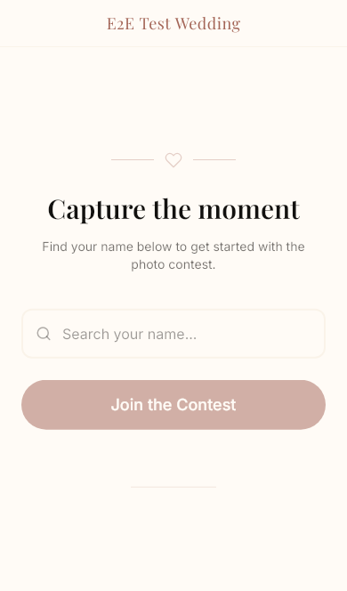
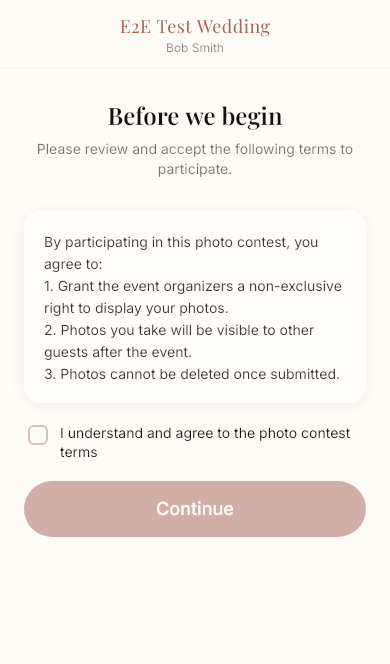
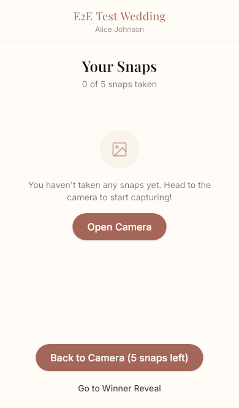
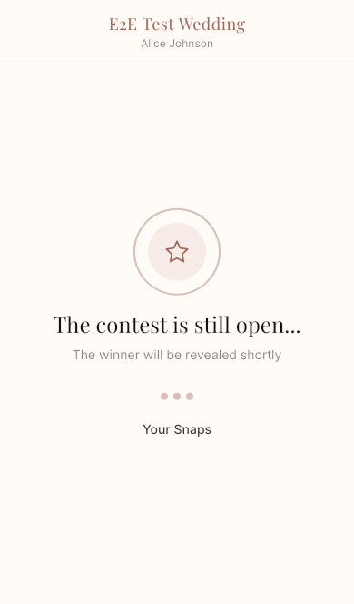

<h1 align="center">Kekkonsnap</h1>

<p align="center">
  <strong>A wedding photo contest that lives in your guests' browsers.</strong><br/>
  Scan QR. Snap photos. Win glory.
</p>

<p align="center">
  
  
  
  
  
  
</p>

<p align="center">
  
  &nbsp;&nbsp;
  
  &nbsp;&nbsp;
  
  &nbsp;&nbsp;
  
</p>

---

## How it works

```
Guest scans QR ──► Enter name ──► Agree to terms ──► Snap photos ──► Wait for reveal
                   (fuzzy match)   (camera only!)     (limited shots)       │
                                                                           ▼
Admin watches live feed ──► Lock event ──► Pick winner ──► Announce ──► Everyone sees
                            (or auto-lock)                   (SSE push)   confetti!
```

No app install. No gallery uploads. Just real camera snaps from real phones.

---

## Quick start

```bash
npm install

cp .env.example .env
# Set JWT_SECRET (min 32 chars)

npm run db:create-event -- \
  --name "Our Wedding" --slug our-wedding --password admin123 --shot-limit 7

npm run db:seed -- --demo    # or --slug our-wedding --file ./data/guests.json

npm run dev
```

| | URL |
|---|---|
| Guest | `http://localhost:3000/our-wedding` |
| Admin | `http://localhost:3000/admin/our-wedding` |

---

## Working with an AI agent

This project is set up for AI-assisted development. If you're using Claude Code, Cursor, Windsurf, Copilot, Aider, or any other coding agent, point it to **[`AGENT.md`](AGENT.md)** to get oriented.

**First prompt to give your agent:**

> Read AGENT.md, then read doc/PLAN.md and src/db/schema.ts to understand the project.

**Example prompts after that:**

> Add a "delete event" button to the admin dashboard

> The camera flash animation feels too slow on iPhone — make it snappier

> Add a rate limit to the photo upload endpoint — max 1 per 2 seconds

> Write e2e tests for the gallery page

The agent will know where to find the schema, conventions, test patterns, and architecture from the files it read.

---

## Guest flow

| Step | Screen | What happens |
|------|--------|--------------|
| 1 | **Landing** | Guest enters name, fuzzy-matched against the guest list |
| 2 | **Terms** | "Photos are public and can't be deleted" — tap to agree |
| 3 | **Camera** | Full-screen viewfinder via `getUserMedia` — no gallery access |
| 4 | **Your Snaps** | Photo grid with swipeable lightbox |
| 5 | **Winner Reveal** | Waiting screen until admin announces — then confetti! |
| 6 | **Gallery** | All photos from all guests, winner pinned at top |

## Admin flow

| Step | What happens |
|------|--------------|
| 1 | Log in at `/admin/our-wedding` |
| 2 | Watch photos stream in, swipe through them in the lightbox |
| 3 | Lock the event manually — or schedule an auto-lock time |
| 4 | Pick a winner from the grid or from inside the lightbox |
| 5 | Hit announce — winner appears on every guest's phone instantly |
| 6 | Download all photos as a ZIP organized by guest name |

---

## Tech stack

| Layer | Choice |
|---|---|
| Framework | **Next.js 15** — App Router, standalone output |
| Language | **TypeScript** strict |
| Database | **SQLite** via better-sqlite3 + **Drizzle ORM** |
| Styling | **Tailwind CSS v4** with custom wedding palette |
| Images | **Sharp** — EXIF orientation, WebP compression, thumbnails |
| Real-time | **SSE** via EventEmitter singleton |
| Auth | **jose** (JWT) + **bcryptjs** (admin passwords) |
| Search | **Fuse.js** for fuzzy guest name matching |
| Deploy | **Docker** multi-stage + **Caddy** auto-HTTPS |

---

## Deploy

### Docker + Caddy (recommended)

```bash
# Edit .env with production values
# Edit Caddyfile — swap kekkonsnap.example.com for your domain

docker compose up -d --build
```

Caddy auto-provisions HTTPS via Let's Encrypt. HTTPS is required for the camera API (`getUserMedia`).

```bash
# Seed the event inside the container
docker compose exec app node scripts/create-event.js \
  --name "Our Wedding" --slug our-wedding --password YOUR_PASSWORD --shot-limit 7
```

### Tailscale (alternative)

For testing or private access without DNS:

```bash
npm run dev
sudo tailscale serve --bg http://localhost:3000
# HTTPS at https://your-machine.tailnet-name.ts.net/
```

---

## Environment variables

| Variable | Description | Default |
|---|---|---|
| `JWT_SECRET` | Secret for signing JWTs (min 32 chars) | Dev default provided |
| `DATABASE_URL` | Path to SQLite database | `./data/kekkonsnap.db` |
| `UPLOAD_DIR` | Path to photo storage directory | `./data/uploads` |
| `ADMIN_MASTER_PASSWORD` | Master password for event management | `kekkonsnap-admin` |

---

## Tests

### Unit — 166 tests across 11 files

```bash
npm test
```

Covers: database schema, auth/JWT, rate limiting, image processing, storage, fuzzy matching, guest API routes, admin API routes, scheduled lock, and schedule checker.

### E2E — 8 device profiles via Playwright

```bash
npx playwright install --with-deps   # first time only
npm run test:e2e
```

| Device | Viewport | Engine |
|--------|----------|--------|
| iPhone SE | 320x568 | WebKit |
| iPhone 14 | 390x844 | WebKit |
| iPhone 15 Pro Max | 430x932 | WebKit |
| Pixel 7 | 412x915 | Chromium |
| Galaxy S23 | 360x780 | Chromium |
| Desktop Chrome | 1280x720 | Chromium |
| Desktop Firefox | 1280x720 | Firefox |
| Desktop Safari | 1280x720 | WebKit |

**Covers:** landing autocomplete, terms flow, camera mocking (denied + ready), photo grid, winner reveal, gallery redirect, full landing-to-winner flow, layout overflow checks, admin dashboard, and per-device visual regression (5% diff tolerance).

---

## Scripts

<details>
<summary><strong>npm scripts</strong></summary>

| Command | Description |
|---|---|
| `npm run dev` | Start dev server |
| `npm run build` | Production build |
| `npm run start` | Start production server |
| `npm test` | Run unit tests (vitest) |
| `npm run test:watch` | Run unit tests in watch mode |
| `npm run test:e2e` | Run Playwright e2e tests (all 8 devices) |
| `npm run test:e2e:ui` | Open Playwright interactive UI |
| `npm run test:e2e:debug` | Run e2e tests in debug mode |
| `npm run test:e2e:update-snapshots` | Regenerate visual regression baselines |
| `npm run lint` | ESLint |
| `npm run db:generate` | Generate Drizzle migrations |
| `npm run db:create-event` | Create a new event via CLI |
| `npm run db:seed` | Seed guest list from file |

</details>

<details>
<summary><strong>make targets</strong></summary>

| Command | Description |
|---|---|
| `make build` | Production build |
| `make start` | Start production server (daemon) |
| `make stop` | Stop production server |
| `make test` | Run unit tests |
| `make test-e2e` | Run Playwright e2e tests |
| `make test-e2e-ui` | Open Playwright interactive UI |
| `make test-all` | Run unit + e2e tests |

</details>

---

## Guest list format

**JSON:**
```json
[
  {"name": "John Smith", "table": "1"},
  {"name": "Jane Doe", "table": "2"}
]
```

**CSV:**
```
name,table
John Smith,1
Jane Doe,2
```

---

## Project structure

```
AGENT.md                  AI agent onboarding guide
src/
  app/
    (guest)/[slug]/       Landing, terms, camera, photos, winner, gallery
    admin/[slug]/         Login, dashboard, guest management
    api/                  Guest + admin API routes, photo serving
  components/
    ui/                   Button, Input, Card, Modal, LoadingSpinner, ProgressBar
    camera/               CameraViewfinder, ShutterButton, ShotCounter
    guest/                NameAutocomplete, TermsConsent, PhotoGrid, PhotoLightbox
    winner/               WinnerReveal, WaitingScreen, ConfettiEffect
    providers/            SessionProvider, EventStreamProvider
  db/                     Schema, connection, seed
  lib/                    Auth, image processing, storage, rate limiting, SSE
e2e/                      Playwright specs, fixtures, global setup
scripts/                  CLI tools (create-event, seed)
doc/                      PLAN.md, SDP.md
```

---

<p align="center">
  <sub>Built for a real wedding. March 2026.</sub>
</p>
